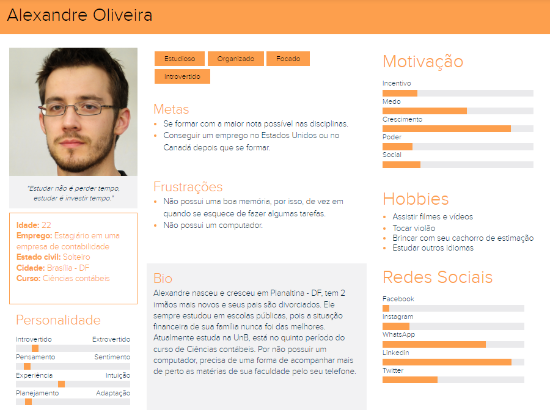
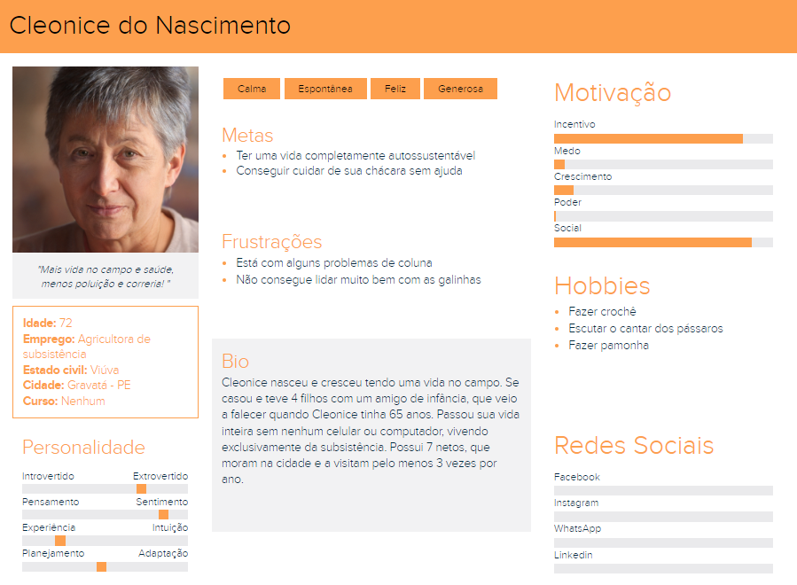

# Personas

## 1. Introdução

 &emsp;&emsp; 
    Para criar um produto de boa qualidade, um ponto muito importante entender quem são os usuários, quais são seus objetivos e suas necessidades. Portanto, para ajudar neste quesito, algumas técnicas podem ser utilizadas neste momento, a que será descrita neste documento, é a utilização de personas.

 &emsp;&emsp; 
    Como descrito por  Cooper et al. (2014), Pruitt e Adlin (2006) e Cooper (1999), uma persona é um personagem fictício, arquétipo hipotético de um grupo de usuários reais,
    criada para descrever um usuário típico. Desta forma, a análise de requisitos se torna mais eficiente, pois existe uma maior facilidade em visualizar os usuários. 

 &emsp;&emsp; 
    Cada projeto possui seu próprio elenco de personas, que consiste de três a 12 personas distintas. Neste caso, foi concebido um elenco de 4 personas, sendo as duas primeiras as personas primárias, que terão um foco maior dos designers, a terceira uma persona secundária, e por último uma antipersona, que representa para quem o aplicativo não foi pensado.

## 2. Resultados

### 2.1 Persona 1

    *Figura 1: Primeira persona, primária*

    *Fonte: Elaboração Própria*

### 2.2 Persona 2

    *Figura 2: Segunda persona, primária*

    *Fonte: Elaboração Própria*

### 2.3 Persona 3

    *Figura 3: Terceira persona, secundária*

    *Fonte: Elaboração Própria*

### 2.4 Antipersona

    *Figura 4: Quarta persona, antipersona*

    *Fonte: Elaboração Própria*

## 3.Referências

- [1] Barbosa, S. D. J.; Silva, B. S. da; Silveira, M. S.; Gasparini, I.; Darin, T.; Barbosa, G. D. J. Interação Humano-Computador e Experiência do usuário. Autopublicação. 2021.

- [2] This Person Does Not Exist. Disponível em: https://thispersondoesnotexist.com/. Acesso em: 27 de nov. de 2022.

## 4.Histórico de versão

| Versão | Data da realização | Data prevista revisão | Descrição | Autor | Revisor |
|--------|------|------|-----------|-------|---------|
| 1.0    | 27/11/2022 | 29/11/2022 | Criação da página Personas | Marcos Vinicius | Davi Lima |
| 1.1    | 27/11/2022 | 29/11/2022 | Adição das personas | Marcos Vinicius | Davi Lima |
| 1.2    | 28/11/2022 | 29/11/2022 | Adição da introdução e referências | Marcos Vinícus | Davi Lima |

