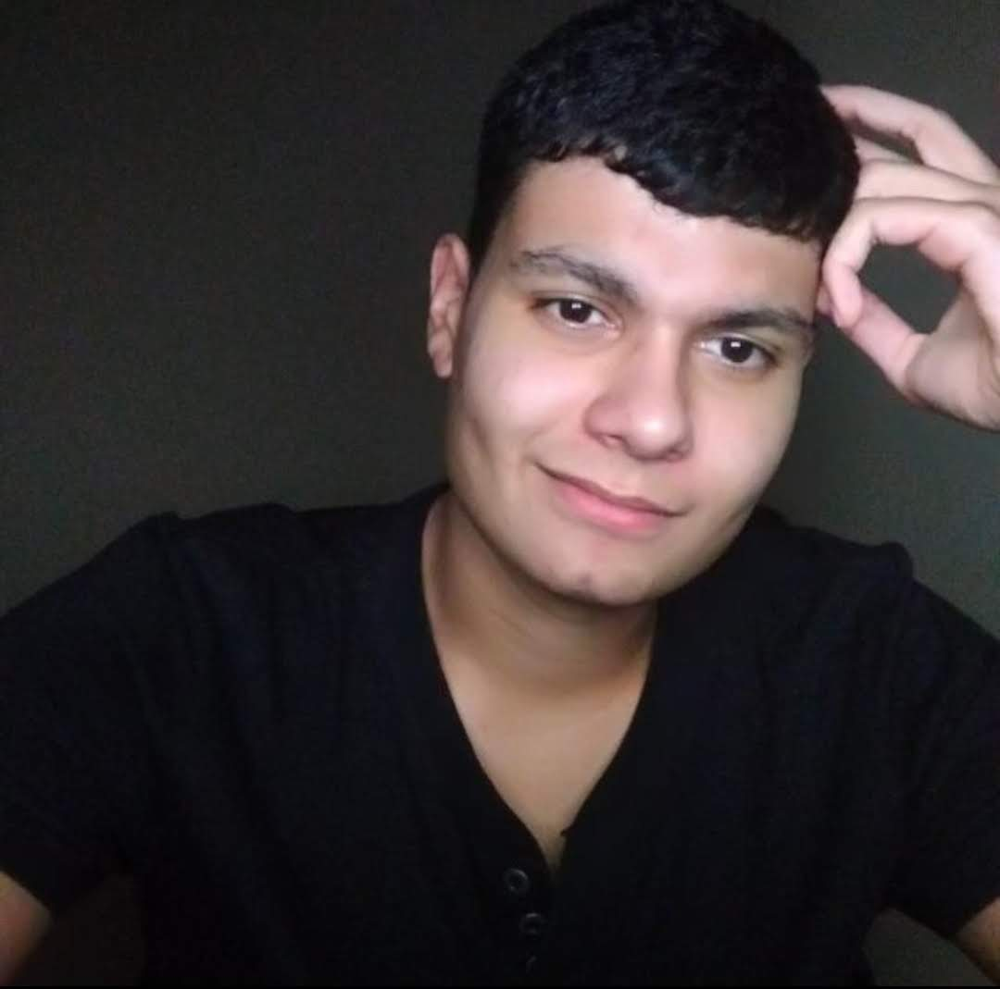
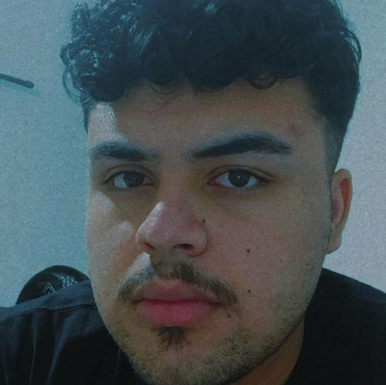
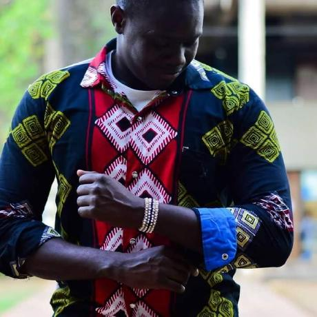

# INICIO

*Figura 1: Logotipo moodle*   
<small>Fonte: https://worknow.com.br/explorando-o-moodle/</small>

## 1. Sobre esse projeto

 &emsp;&emsp; Esse documento tem como intuito documentar os requisitos essenciais (funções, desempenho, restrições de projeto e atributos), do software selecionado pelo grupo 07, da disciplina de requisitos de software, ministrada pelo professor Andre Barros de Sales, do curso de engenharia de software, da Universidade de Brasília, campus FGA-Gama. Esse projeto apresenta a construção da investigação e elicitação de artefatos para o desenvolvimento do estudo da disciplina de requisitos de software.

## 2. Sobre o aplicativo

 &emsp;&emsp; Moodle é uma plataforma de aprendizagem projetada para fornecer a educadores, administradores e alunos um único sistema robusto, seguro e integrado para criar ambientes de aprendizagem personalizados.Capacitando centenas de milhares de ambientes de aprendizagem globalmente, o Moodle tem a confiança de instituições e organizações grandes e pequenas, incluindo Shell, London School of Economics, State University of New York, Microsoft and the Open University. Os números globais do Moodle, mais de 213 milhões de usuários em nível acadêmico e empresarial, tornam a plataforma de aprendizagem a mais usada do mundo.Com mais de 10 anos de desenvolvimento orientado pela pedagogia construcionista social, o Moodle oferece um poderoso conjunto de ferramentas centradas no aluno e ambientes de aprendizagem colaborativos que capacitam tanto o ensino quanto a aprendizagem. Uma interface simples, funcionalidade de arrastar e soltar e recursos bem documentados junto com melhorias contínuas de usabilidade tornam o Moodle fácil de aprender e usar. O Moodle é fornecido gratuitamente como software Open Source, sob a GNU General Public License. Qualquer pessoa pode adaptar, estender ou modificar o Moodle para projetos comerciais e não comerciais sem nenhuma taxa de licenciamento e se beneficiar da economia, flexibilidade e outras vantagens de usar o Moodle.

## 3. Equipe

|                                                                    |      Membro       |      Github      |
| :----------------------------------------------------------------: | :---------------: | :--------------: |
|    |  Arthur Vinicius  |  ArturVinicius   |
|          |     Davi Lima     |   DaviSilva25    |
|      |   Delziron Braz   |   DelzironBraz   |
|    |  Marcos Vinicius  |    Marcos574     |
|     |  Rodolfo Cabral   |      roddas      |
|  | Pablo Christianno | PabloChristianno |

## 4. Referências

Link para a pagina da comunidade do app moodle: https://moodle.org/

Link para a pagina de desenvolvimento do app moodle: https://moodledev.io/

## 5. Versionamento

| Versão | Data da realização | Data prevista revisão | Descrição | Autor | Revisor |
|--------|------|------|-----------|-------|---------|
| 1.0    | 18/11/2022 | 19/11/2022 | Criação da página Inicio | Delziron Braz | Davi Lima |
| 1.1    | 18/11/2022 | 19/11/2022 | Adição do tópico sobre o projeto | Delziron Braz | Davi Lima |
| 1.2    | 18/11/2022 | 19/11/2022 | Adição do tópico sobre o app | Delziron Braz | Davi Lima |
| 1.3    | 18/11/2022 | 19/11/2022 | Adição de descrições e fotos dos integrantes | Delziron Braz | Davi Lima |
| 2.0    | 20/11/2022 | 21/11/2022 | Adição das referencias | Davi Lima | Delziron Braz |
| 2.1    | 20/11/2022 | 21/11/2022 | Adição do versionamento | Davi Lima | Delziron Braz |
| 2.2    | 20/11/2022 | 21/11/2022 | Formatação dos textos | Davi Lima | Delziron Braz |
| 2.3    | 20/11/2022 | 21/11/2022 | Adição do logo do projeto | Davi Lima | Delziron Braz |
| 2.3    | 20/11/2022 | 21/11/2022 | Revisão finalizada | Davi Lima | Delziron Braz |
