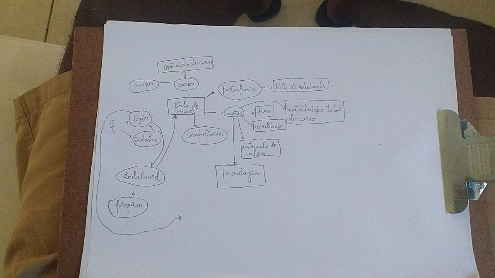

# Rich Picture

## 1.Introdução
&emsp;&emsp; Rich Picture é uma modelagem cuja notação permite analisar problemas e analisar idéias [3]. 
Abaixo, estão sendo expostos os rich pictures, em duas versões, a primeira feita à mão, menos complexa que a segunda, que foi feito no aplicativo Figma, após uma melhor análise do aplicativo.

## 2. Rich Pictures

### 2.1 Rich Picture versão 1 aplicativo do Moodle

<figcaption align='center'>
    <b>Figura 2: Versão inicial Rich Picture</b>
     <small>Fonte: Elaboração Própria</small>
</figcaption>

### 2.2 Rich Picture Versão 2 do aplicativo Moodle

<iframe style="border: 1px solid rgba(0, 0, 0, 0.1);" width="800" height="450" src="https://www.figma.com/embed?embed_host=share&url=https%3A%2F%2Fwww.figma.com%2Ffile%2FSONlcNwUINYMjN1iUN06wE%2FRich-Picture-moodle%3Fnode-id%3D0%253A1%26t%3DOLTJwlgB5vXjbkJP-1" allowfullscreen></iframe>

<figcaption align='center'>
    <b>Figura 2: Segunda versão Rich Picture</b>
     <small>Fonte: Elaboração Própria</small>
</figcaption>

## 3.Referências
- [1] "Introducing Rich Pictures - Picture Drawing Guidelines" - Software Development Project

- [2] MONK, Andrew; HOWARD, Steve. "The Rich Picture: A Tool for Reasoning About Work Context". 1998

- [3] [Apresentação da aula de requisitos-  Pré-rastreabilidade -Rich Picture Aula 04](https://aprender3.unb.br/pluginfile.php/2307459/mod_resource/content/4/Requisitos%20-%20Aula%2004%20-%20Parte%202%20RichPicture.pdf)

## 4.Histórico de versão

| Versão | Alteração | Responsável | Revisor | Data |
|:------:|:---------:|:-----------:|:-------:|:----:|
| 1.0    |Rich Picture versão 1| Rodolfo |  Arthur  |  17/11/2022    |
| 1.1   |Rich Picture versão 2| Marcos e Pablo  |  Davi  |   17/11/2022   |
| 1.2   |Construção da página| Marcos  | Delziron  |   19/11/2022   |        
