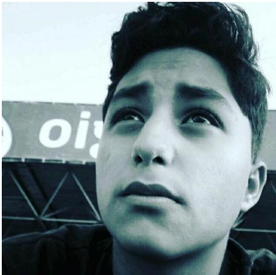
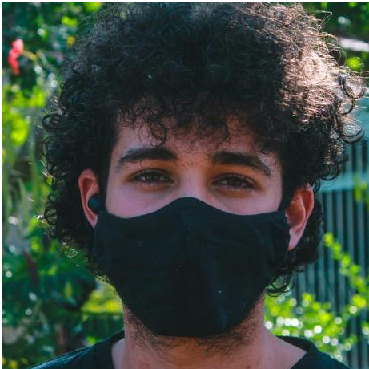

# Inicio

## 1. Sobre esse projeto

&emsp;&emsp;Esse documento tem como intuito documentar os requisitos essenciais (funções, desempenho, restrições de projeto e atributos), do software selecionado pelo grupo 07, da disciplina de requisitos de software, ministrada pelo professor Andre Barros de Sales, do curso de engenharia de software, da Universidade de Brasília, campus FGA-Gama. Esse projeto apresenta a construção da investigação e elicitação de artefatos para o desenvolvimento do estudo da disciplina de requisitos de software.

## 2. Sobre o aplicativo

&emsp;&emsp;Moodle é uma plataforma de aprendizagem projetada para fornecer a educadores, administradores e alunos um único sistema robusto, seguro e integrado para criar ambientes de aprendizagem personalizados.Capacitando centenas de milhares de ambientes de aprendizagem globalmente, o Moodle tem a confiança de instituições e organizações grandes e pequenas, incluindo Shell, London School of Economics, State University of New York, Microsoft and the Open University. Os números globais do Moodle, mais de 213 milhões de usuários em nível acadêmico e empresarial, tornam a plataforma de aprendizagem a mais usada do mundo.Com mais de 10 anos de desenvolvimento orientado pela pedagogia construcionista social, o Moodle oferece um poderoso conjunto de ferramentas centradas no aluno e ambientes de aprendizagem colaborativos que capacitam tanto o ensino quanto a aprendizagem. Uma interface simples, funcionalidade de arrastar e soltar e recursos bem documentados junto com melhorias contínuas de usabilidade tornam o Moodle fácil de aprender e usar. O Moodle é fornecido gratuitamente como software Open Source, sob a GNU General Public License. Qualquer pessoa pode adaptar, estender ou modificar o Moodle para projetos comerciais e não comerciais sem nenhuma taxa de licenciamento e se beneficiar da economia, flexibilidade e outras vantagens de usar o Moodle.

## 3. Equipe

|                                                                     | Membro            | Github           |
| ------------------------------------------------------------------- | ----------------- | ---------------- |
|     | Arthur Vinicius   | ArturVinicius    |
|           | Davi Lima         | DaviSilva25      |
|       | Delziron Braz     | DelzironBraz     |
|     | Marcos Vinicius   | Marcos574        |
|     | Rodolfo Cabral    | roddas           |
|   | Pablo Christianno | PabloChristianno |

## 4. Aplicativos analisados

## 5. Histórico de Versão
