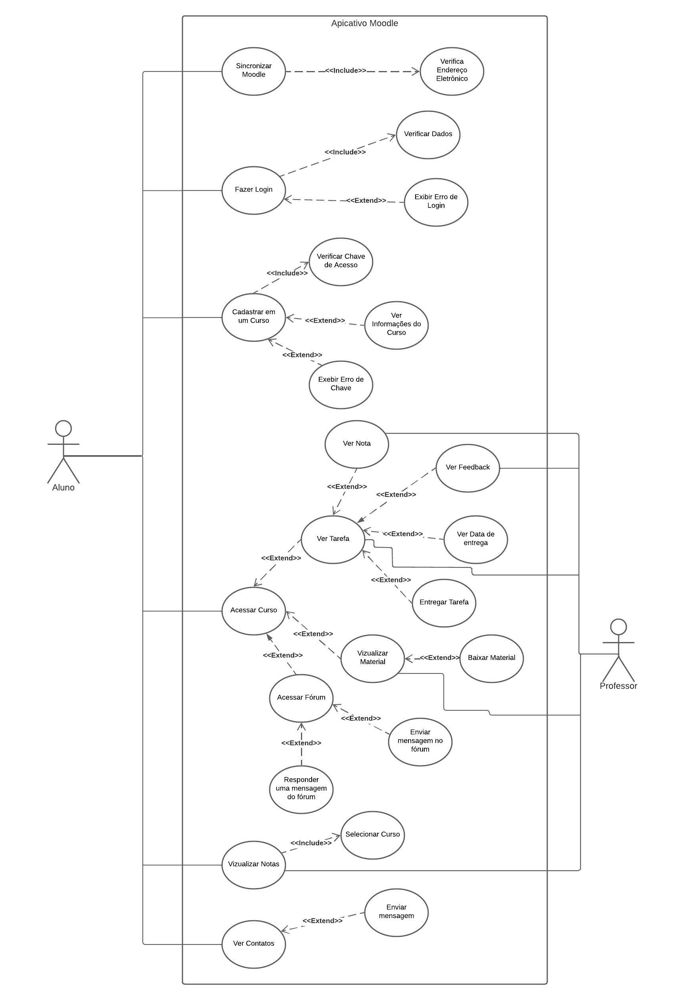

# Casos de Uso

## 1. Introdução 

 &emsp; &emsp;
    Caso de uso é uma técnica de modelagem de requisitos funcionais, através dela é capaz de representar  um conjunto de sequências de ações
    que o usuário é capaz de realizar no sistema seguindo um fluxo de eventos possíveis para atingir um determinado objetivo. Comumente 
    representado por um diagrama UML aonde se expõe seus elementos: atores, sistema, casos de uso e relacionamento. Entretanto é importante
    fazer uso de especializações de casos de uso, uma descrição complementar ao diagrama que trás mais detalhes sobre os casos de uso do 
    diagrama.

## 2. Participantes
*    Arthur Vinicius
*    Pablo Christianno

## 3. Diagrama UML de Casos de Uso

    *Figura 1: Diagrama de Caso de Uso*

## 4. Especializações de Casos de Uso

## 5. Referências

## 6. Histórico de Versionamento

| Versão | Data da realização | Data prevista revisão | Descrição | Autor | Revisor |
|--------|------|------|-----------|-------|---------|
| 1.0    | 10/12/2022 | 10/12/2022 | Estruturação e criação da página | Pablo Christianno e Arthur Vinicius | Delziron Braz |